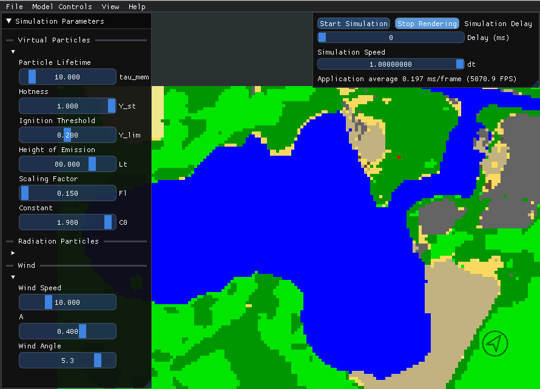
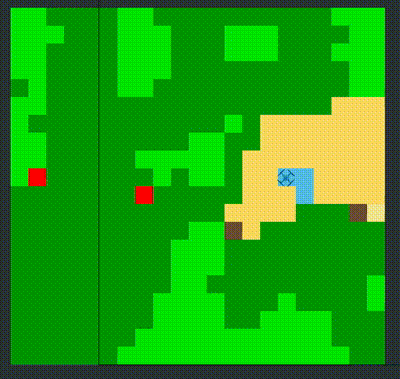

# ROSHAN

ROSHAN (Rescue Oriented Simulation: Handling and Navigating Fires), is a wildfire simulation tool. ROSHAN integrates the principles of cellular automata with reinforcement learning to simulate wildfire dynamics and automatic handling. entral to this simulation tool is its rendering and simulation of fire spread, achieved by integrating data from the CORINE database. The interactive graphical interface of ROSHAN facilitates real-time monitoring and manipulation of fire scenarios. A key component in ROSHAN is the incorporation of a Reinforcement Learning agent, embodied as a drone, which learns to detect and mitigate fires.

You can read everything about the development [here](paper.pdf).

# Installation

Clone the repositories with submodules

`git clone --recurse-submodules https://github.com/RoblabWh/ROSHAN.git`

#### NodeJS

`cd openstreetmap`

`npm install express body-parser`

`npm install --save-dev nodemon`

#### CORINE CLC+ 

ROSHAN offers the possibility to generate custom Maps from realworld data using the CORINE Landcover Database. **If you wish NOT to use custom maps you can use the small sample maps provided by this repository, you don't need to download the database in this case!**

To load custom maps from all over Europe you need to register to **EU Login**, the European Commission's user authentication service and download the
CLC+ Backbone Database:

[Download Corine CLC+ Backbone - 10 meter (Year 2018 or 2021)](https://land.copernicus.eu/pan-european/clc-plus/clc-backbone/clc-backbone?tab=download)

Once compiled you can set the dataset_path in the **config.json**, the standard path is **/ROSHAN/assets/dataset/CLMS_CLCplus_RASTER_2021_010m_eu_03035_V1_1.tif**.

## Dependencies

#### GDAL and GDAL C++ headers

`sudo apt install libgdal-dev gdal-bin libsdl2-image-dev`

#### SDL2 - min. 2.0.17 

Install SDL2 according to:

`sudo apt-get install libsdl2-2.0-0 libsdl2-image-2.0-0`

##### Anaconda & PyTorch

`conda create --name roshan python=3.9 libffi==3.3`

`conda activate roshan`

`pip install torch torchvision`

`conda install tensorboard`

`conda install packaging`

##### LLM Support

`pip install transformers[torch] onnxruntime bitsandbytes optimum onnx`

#### Compile

`cd \ROSHAN`

`mkdir build && cd build`

`cmake .. && make -j&(nproc)`

# Usage

Start ROSHAN either as pure C++ Simulation or with Reinforcement Learning Support:

### ROSHAN Sim

`cd to/your/build/directory`

`./ROSHAN`

### ROSHAN Sim + Reinforcement Learning

`cd ROSHAN/src/pysim/`

`python main.py`