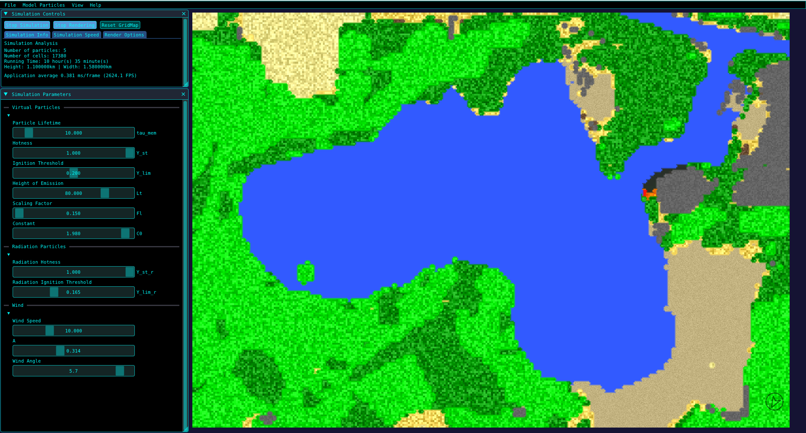

# ROSHAN  


**ROSHAN** (Reinforcement-learning Oriented Simulation for Hierarchical Agent Navigation) is a wildfire simulation and reinforcement-learning framework.   
It combines a **C++ wildfire model** based on cellular automata with a **Python-based hierarchical RL system** for autonomous UAV firefighting.

ROSHAN supports:
- 🔥 Wildfire propagation simulation  
- 🛰 Autonomous firefighting agents (FlyAgent, ExploreAgent, PlannerAgent)  
- 🖥 An interactive GUI for visualization and debugging  
- ⚙️ Full No-GUI operation for large-scale or headless experiments  
- 🤖 Integration with PyTorch for training agents  
- 🌍 Optional real-world map generation via CORINE datasets  

You can read more about the system’s development in the accompanying master thesis:  
📄 [Thesis](assets/meine_thesis.pdf)

---
<video src="assets/planner_agent.mp4" controls></video>

# 🚀 Installation

Clone the repository with all submodules:

```bash
git clone --recurse-submodules https://github.com/RoblabWh/ROSHAN.git
```

### CORINE CLC+ (optional, only for generating real-world maps)
ROSHAN can generate maps from the **CORINE Land Cover** database.  
If you do not need real-world maps, simply use the sample maps included in the repository.

To use custom maps:
1. Register for EU Login
2. Download the CLC+ Backbone dataset (10 m resolution):

👉 [Download CLC+ Backbone (2018/2021)](https://land.copernicus.eu/pan-european/clc-plus/clc-backbone/clc-backbone?tab=download)

After downloading, set the dataset path in project_paths.json.
The default location is:

```bash
ROSHAN/assets/dataset/CLMS_CLCplus_RASTER_2021_010m_eu_03035_V1_1.tif
```

## 📦 Dependencies

### NodeJS (for OpenStreetMap support)
```bash
cd openstreetmap
npm install express body-parser
npm install --save-dev nodemon
```

### GDAL, SDL2, and system libraries
```bash
sudo apt install libgdal-dev gdal-bin libsdl2-image-dev
sudo apt install libsdl2-2.0-0 libsdl2-image-2.0-0
```

### Python Environment (Anaconda + PyTorch)
```bash
conda create --name roshan python=3.9 libffi==3.3
conda activate roshan
pip install torch torchvision tabulate scipy
conda install tensorboard
conda install packaging
```

### Optional: LLM support (experimental and currently non-functional)
```
pip install transformers[torch] onnxruntime bitsandbytes optimum onnx
```

## 🔧 Build Instructions
```bash
cd ROSHAN
mkdir build && cd build
cmake .. && make -j$(nproc)
```

# ▶️ Usage

ROSHAN can be launched in two main modes and through a testing notebook:

## 1. C++ Simulation Only
For running the simulator without reinforcement learning:
```bash
cd path/to/build/directory
./ROSHAN
```
## 2. Simulation + Reinforcement Learning
Run ROSHAN with the Python RL framework (PPO, hierarchical agents, etc.):
```bash
cd ROSHAN/src/pysim/ 
python main.py ["optional/path/to/your/own/config.yaml"]
```
The Python interface loads your configuration, initializes the C++ simulator, and trains/evaluates agents depending on the settings in the config file.