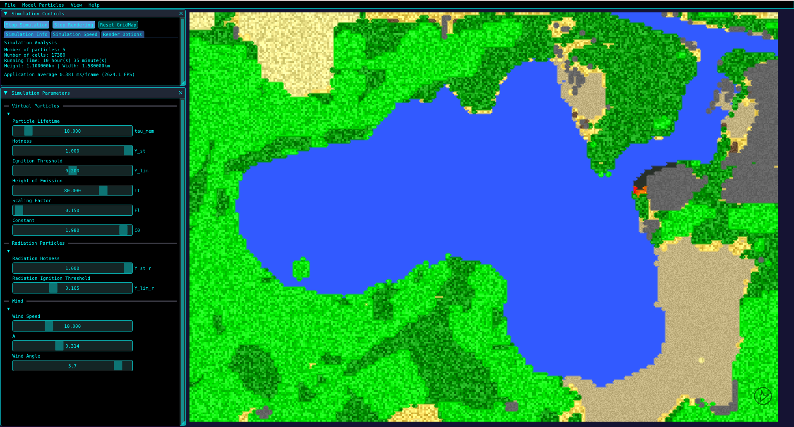

# ROSHAN  


**ROSHAN** (Reinforcement-learning Oriented Simulation for Hierarchical Agent Navigation) is a wildfire simulation and reinforcement-learning framework.   
It combines a **C++ wildfire model** based on cellular automata with a **Python-based hierarchical RL system** for autonomous UAV firefighting.

ROSHAN supports:
- 🔥 Wildfire propagation simulation  
- 🛰 Autonomous firefighting agents (FlyAgent, ExploreAgent, PlannerAgent)  
- 🖥 An interactive GUI for visualization and debugging  
- ⚙️ Full No-GUI operation for large-scale or headless experiments  
- 🤖 Integration with PyTorch for training agents  
- 🌍 Optional real-world map generation via CORINE datasets  

You can read more about the system’s development in the accompanying master thesis:  
📄 [Thesis](assets/meine_thesis.pdf)

---
  
[Larger Planner Agent Demo](assets/planner_agent.mp4)

# 🚀 Installation

Clone the repository with all submodules:

```bash
git clone --recurse-submodules https://github.com/RoblabWh/ROSHAN.git
```

### CORINE CLC+ (optional, only for generating real-world maps)
ROSHAN can generate maps from the **CORINE Land Cover** database.  
If you do not need real-world maps, simply use the sample maps included in the repository.

To use custom maps:
1. Register for EU Login
2. Download the CLC+ Backbone dataset (10 m resolution):

👉 [Download CLC+ Backbone (2018/2021)](https://land.copernicus.eu/pan-european/clc-plus/clc-backbone/clc-backbone?tab=download)

After downloading, set the dataset path in project_paths.json.
The default location is:

```bash
ROSHAN/assets/dataset/CLMS_CLCplus_RASTER_2021_010m_eu_03035_V1_1.tif
```

## 📦 Dependencies

### NodeJS (for OpenStreetMap support)
```bash
cd openstreetmap
npm install express body-parser
npm install --save-dev nodemon
```

### GDAL, SDL2, and system libraries
```bash
sudo apt install libgdal-dev gdal-bin libsdl2-image-dev python3-dev
sudo apt install libsdl2-2.0-0 libsdl2-image-2.0-0
```

### Python Environment (uv)
```bash
uv sync
```

To include optional LLM support (experimental and currently non-functional):
```bash
uv sync --extra llm
```

## 🔧 Build Instructions
```bash
cd ROSHAN
source .venv/bin/activate  # Activate the virtual environment
mkdir build && cd build
cmake .. && make -j$(nproc)
```

# ▶️ Usage

ROSHAN can be launched in two main modes and through a testing notebook:

## 1. C++ Simulation Only
For running the simulator without reinforcement learning:
```bash
./build/ROSHAN   # works from any directory (resolves paths via project_paths.json)
```
## 2. Simulation + Reinforcement Learning
Run ROSHAN with the Python RL framework (PPO, hierarchical agents, etc.):
```bash
cd ROSHAN
# Layered config: config/base.yaml + overlays + dotted CLI overrides
python src/pysim/main.py config/agent/fly.yaml
python src/pysim/main.py config/agent/planner.yaml algorithm.PPO.lr=3e-4
```
Config is layered with OmegaConf: `config/base.yaml` holds shared defaults, while small
overlays under `config/agent/` and `config/exp/` carry only the deltas. Positional `*.yaml`
args are overlays (merged in order on top of base); `key=value` args override any dotted
path. The Python interface merges these, dumps the effective config to `used_config.yaml`
(which the C++ simulator parses), and trains/evaluates per the resolved settings.

## 3. Evaluation, inference and baselines
Two path keys govern where a run reads and writes:

- `paths.model_directory` — **load from** here (checkpoint, `networks/`, trained `config.yaml`).
- `paths.run_dir` — **write to** here (`config.yaml` snapshot, `logs/evaluation_stats.csv`, plots,
  `tensorboard_logs/`, checkpoints). Empty = write into `model_directory` (in place).

Short flags expand to overlays under `config/mode/` and `config/baseline/` plus dotted overrides.
They are appended after the positional args, so they win over experiment overlays:

| flag | effect |
|---|---|
| `--eval` | headless evaluation (`config/mode/eval.yaml`) |
| `--watch` | GUI inference, nothing logged (`config/mode/watch.yaml`) |
| `--baseline greedy\|hungarian` | heuristic assignment instead of the planner network |
| `--model-dir DIR` | load from `DIR`; also merges `DIR/config.yaml` (architecture, environment, hierarchy) after base, so no agent overlay is needed |
| `--model-name NAME` | `latest`, `best_reward`, `best_obj` or an explicit `*.pt` |
| `--run-dir DIR` | write outputs to `DIR` |
| `--n N`, `--seed S` | evaluation episodes, seed |

```bash
# Watch what a trained planner does (model directory untouched)
python src/pysim/main.py --watch --model-dir models/PlannerSMDP_G2_s2

# Paired evaluation arms for one scenario: each arm gets its own config.yaml + CSV under run_dir
python src/pysim/main.py config/agent/planner.yaml config/exp/planner_hard.yaml \
  --eval --n 100 --seed 100 --model-dir models/PlannerSMDP_G2_s2 --model-name best_obj \
  --run-dir experiments/A1/runs/learned
python src/pysim/main.py config/agent/planner.yaml config/exp/planner_hard.yaml \
  --eval --n 100 --seed 100 --model-dir models/PlannerSMDP_G2_s2 --baseline hungarian \
  --run-dir experiments/A1/runs/hungarian

# Compare arms (paired by episode fingerprint; refuses runs that were not seeded identically)
python src/pysim/analysis/paired_eval.py \
  --arm hungarian experiments/A1/runs/hungarian/logs/evaluation_stats.csv \
  --arm learned   experiments/A1/runs/learned/logs/evaluation_stats.csv
```
A complete multi-arm recipe lives in `experiments/planner_static_A1/launch.sh`. In eval mode a
checkpoint that fails to load is an error, never a silent fall-back to training.